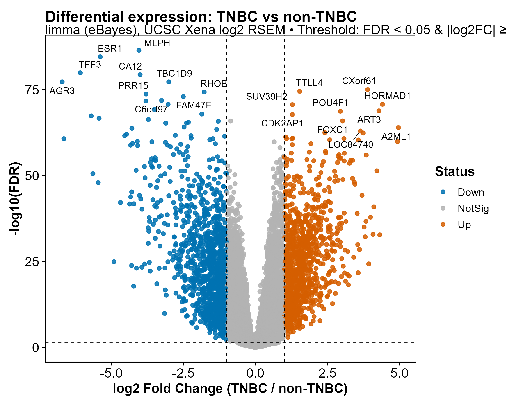
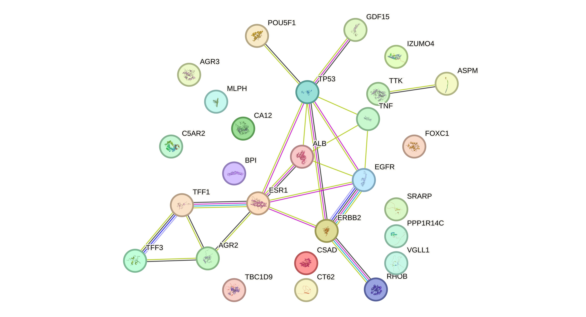
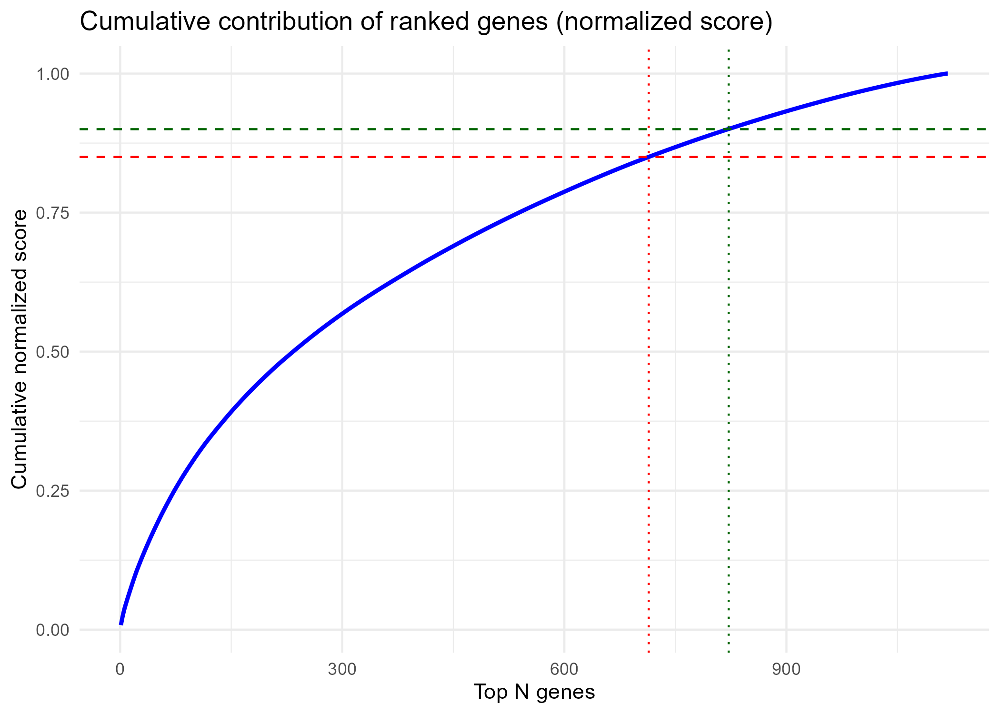

# TNBC Multi-Omics Target Discovery

A network-guided computational framework for identifying potential therapeutic targets in **Triple-Negative Breast Cancer (TNBC)** through the integration of **TCGA transcriptomic data**, **protein–protein interaction networks**, and **machine learning–based target prioritization**.

This pipeline integrates differential gene expression analysis, pathway enrichment, mutation data integration, network biology, and predictive modeling to systematically identify and prioritize candidate genes associated with TNBC progression.

## Table of Contents

* [Pipeline Overview](#pipeline-overview)
* [Dataset](#dataset)
* [Computational Workflow](#computational-workflow)
* [Repository Structure](#repository-structure)
* [Key Methods and Tools](#key-methods-and-tools)
* [Results](#results)
* [Reproducibility](#reproducibility)
* [Author](#author)

# Pipeline Overview

This pipeline processes TCGA breast cancer transcriptomic data to identify TNBC-specific gene expression patterns and prioritize therapeutic targets through network-guided machine learning.

## Computational Workflow

```
TCGA BRCA Dataset
        ↓
Sample QC & Filtering
        ↓
TNBC Cohort Selection
        ↓
Differential Expression (limma)
        ↓
GSEA Pathway Analysis
        ↓
Mutation Integration
        ↓
STRING PPI Network
        ↓
Network Sensitivity Analysis
        ↓
Machine Learning Target Ranking
        ↓
Final Therapeutic Targets
```

For a step-by-step explanation of each stage of the analysis pipeline, see the detailed documentation:

[Pipeline Step Documentation](docs/pipeline_overview.md)

---

# Dataset

**Source:** The Cancer Genome Atlas (TCGA)

Datasets used in this project:

* **TCGA-BRCA RNA-seq transcriptomic data**
* **Clinical metadata**
* **Somatic mutation data**

The dataset was filtered to extract **TNBC patient samples** based on receptor status.

---

# Computational Workflow

The analysis pipeline consists of the following stages:

1. Sample quality control and filtering
2. TNBC cohort selection
3. Differential gene expression analysis using **limma**
4. Gene set enrichment analysis using **MSigDB Hallmark pathways**
5. Mutation data integration
6. Construction of **STRING protein–protein interaction networks**
7. Network sensitivity analysis
8. Machine learning-based target ranking
9. Final candidate therapeutic target identification

---

# Repository Structure

```
TNBC-MultiOmics-Target-Discovery
│
├── docs
│   └── pipeline_overview.md
│
├── environment
│   └── software_environment.md
│
├── scripts
│   ├── 00_QC_sample_flow.R
│   ├── 01_import_and_audit_expression.R
│   ├── 02_define_TNBC_labels.R
│   ├── 03_build_final_cohorts.R
│   ├── 04_transcriptome_QC_PCA.R
│   ├── 05_differential_expression_limma.R
│   ├── 06_GSEA_hallmark_analysis.R
│   ├── 07_mutation_integration.R
│   ├── 08_STRING_network_analysis.R
│   ├── 08b_network_sensitivity_analysis.R
│   ├── 09_define_STRING_gene_sets.R
│   ├── 10_network_guided_ML_target_ranking.R
│   ├── 11_define_STRING_gene_cutoff.R
│   ├── 12_nested_cross_validation.R
│   ├── 13_final_target_panel.R
│   └── 14_final_target_intersection.R
│
├── results
│   ├── QC
│   ├── DEG
│   ├── GSEA
│   ├── STRING
│   ├── ML
│   └── targets
│
├── figures
│   ├── Volcano_TNBC_vs_nonTNBC.png
│   ├── STRING_seed_network.png
|   ├── Cumulative_score_curve.png
│   
│   
│
├── README.md
└── .gitignore
```

---

# Key Methods and Tools

The pipeline integrates multiple computational biology tools and resources:

* **R programming language**
* **limma** for differential expression analysis
* **MSigDB Hallmark pathways** for gene set enrichment analysis
* **STRING database** for protein–protein interaction networks
* **Machine learning models** for therapeutic target prioritization

---
## Key Result Visualizations

### Differential Gene Expression



*Volcano plot showing significantly upregulated and downregulated genes in TNBC compared with non-TNBC breast cancer samples.*

---

### STRING Protein Interaction Network



*Protein–protein interaction network highlighting hub genes involved in TNBC regulatory pathways.*

---

### Machine Learning Target Prioritization



*Cumulative score curve used to determine optimal gene cutoff for STRING network and machine learning target prioritization.*
# Results

The pipeline identifies candidate genes that may serve as **therapeutic targets in Triple-Negative Breast Cancer (TNBC)** by integrating transcriptomic signals with protein interaction networks and predictive modeling.

Intermediate outputs and final results are organized within the **results/** directory.


### TCGA Data Acquisition

RNA-seq gene expression data for the TCGA Breast Cancer (BRCA) cohort was downloaded using the TCGAbiolinks package.

Dataset characteristics:

- Total samples: 1231
- Data type: Gene Expression Quantification
- Workflow: STAR – Counts
- Reference genome: hg38

### Expression Matrix Construction

Raw STAR count files were processed and merged into a unified expression matrix.

Final matrix dimensions:

- Genes: 60,664
- Samples: 1,231

Each column corresponds to a TCGA sample, and each row represents a gene feature.

### Data Structure

The expression matrix was converted into a Bioconductor `SummarizedExperiment` object for compatibility with downstream genomic analysis tools.

Object summary:

Class: SummarizedExperiment  
Dimensions: 60,664 genes × 1,231 samples  
Assay: raw STAR count matrix

### Cohort Construction

The TCGA-BRCA dataset was processed to construct a high-quality transcriptomic cohort for TNBC analysis.

| Dataset | Samples |
|--------|--------|
Total expression samples | 1218 |
TNBC samples | 123 |
Non-TNBC samples | 1095 |

For mutation integration:

| Dataset | Samples |
|--------|--------|
Samples with mutation data | 1024 |
TNBC with mutation data | 121 |
Non-TNBC with mutation data | 903 |

The final expression matrix contained **20,530 genes across 1,218 samples**.

---

### Differential Gene Expression

Differential expression analysis was performed using the **limma** package comparing:

**TNBC vs Non-TNBC**

After filtering:

| Metric | Value |
|------|------|
Genes analyzed | 20,252 |
Upregulated genes in TNBC | 1,145 |
Downregulated genes in TNBC | 1,308 |

Generated outputs include:

```
results/DEG/
├── DE_full_TNBC_vs_nonTNBC.tsv
├── DE_up_TNBC.tsv
├── DE_down_TNBC.tsv
├── DE_ranked_list_for_GSEA.rnk
└── Volcano_TNBC_vs_nonTNBC.png
```

These genes represent transcriptional programs associated with TNBC biology.

---

### Gene Set Enrichment Analysis (GSEA)

Gene ranking from differential expression was used to perform enrichment analysis using **MSigDB Hallmark pathways**.

| Metric | Value |
|------|------|
Hallmark gene sets tested | 50 |
Significantly enriched pathways | 24 |

Output files:

```
results/GSEA/
├── GSEA_Hallmark_full_results.tsv
├── GSEA_Hallmark_UP.tsv
├── GSEA_Hallmark_DOWN.tsv
└── GSEA_Hallmark_TopPathways.png
```

These pathways highlight biological processes driving TNBC tumor progression.

---

### Mutation Integration

Somatic mutation data from TCGA MAF files was integrated with the transcriptomic cohort.

| Group | Samples |
|------|------|
TNBC samples | 121 |
Non-TNBC samples | 898 |

Mutation frequencies were compared using **Fisher’s Exact Test**.

Significant differentially mutated genes included:

```
TP53
PIK3CA
FAT3
GATA3
PCNT
CDH1
```

Generated outputs:

```
results/mutation/
├── Mutation_comparison_significant.tsv
├── Mutation_oncoplots
└── Mutation_QC_summary.txt
```

---

### STRING Protein–Protein Interaction Network

Genes derived from differential expression, mutation signals, and pathway enrichment were integrated into a **STRING interaction network**.

| Metric | Value |
|------|------|
Genes used for network | 2458 |
Mapped STRING genes | 2340 |
Network nodes | 2277 |
Network edges | 44,870 |

Network centrality analysis identified highly connected hub genes.

Example hubs include:

```
TP53
EGFR
ESR1
CCNA2
CDK1
AURKA
KIF11
MKI67
```

Outputs:

```
results/STRING/
├── STRING_network_files
└── Top20_STRING_hubs.tsv
```

---

### Machine Learning Target Prioritization

Machine learning models were used to prioritize candidate therapeutic targets by integrating:

- Differential expression
- Network topology
- Mutation evidence

Feature set size:

**1118 genes**

Models applied:

- Random Forest
- LASSO regularization

Model performance:

| Metric | Value |
|------|------|
Random Forest AUC | 1.0 |
LASSO lambda | 0.009 |

Final ranked targets were saved in:

```
results/ML_Target_Ranking/
└── Final_target_ranking.tsv
```

---

### Top Predicted Therapeutic Targets

Top ranked candidate genes include:

| Gene | Evidence |
|------|------|
CASD1 | ML + DEG |
ESR1 | DEG + network hub |
ERBB2 | DEG |
C19orf36 | ML signal |
CA12 | DEG |
TFF3 | DEG |
TP53 | mutation + network hub |
EGFR | network hub |
RHOB | DEG |
BPI | DEG |

These genes represent potential therapeutic targets for **Triple-Negative Breast Cancer (TNBC)**.

---

### Model Validation

Nested cross-validation was performed to evaluate classification performance.

| Metric | Value |
|------|------|
Mean AUC | 0.965 |
Standard deviation | 0.025 |

This indicates strong predictive power for distinguishing TNBC from non-TNBC samples.

---

### Results Directory

All intermediate outputs and final analysis results are organized within:

```
results/
├── QC
├── DEG
├── GSEA
├── STRING
├── ML
└── targets
```

Each directory contains analysis outputs, tables, and figures generated by the pipeline.

### Final Dataset

The processed dataset was saved in R serialized format:

data_raw/TCGA_BRCA_STAR_counts_FINAL.rds

This file serves as the primary input for downstream analyses including TNBC cohort selection, differential expression analysis, pathway enrichment, network analysis, and machine learning–based target prioritization.

---

## Key Findings

- Differential expression analysis identified key genes dysregulated in TNBC compared with other breast cancer subtypes.
- Network analysis revealed central hub genes including **TP53, EGFR, ESR1, CDK1, and AURKA**.
- Machine learning models prioritized candidate therapeutic targets by integrating transcriptomic signals with network topology.
- The integrated pipeline provides a systematic framework for therapeutic target discovery in Triple-Negative Breast Cancer.
  
---

# Reproducibility

To reproduce the analysis:

1. Download TCGA BRCA RNA-seq data.
2. Install the required R packages listed in:

```
environment/software_environment.md
```

3. Execute the scripts sequentially from the **scripts/** directory.

---

# Author

**Y. Showri Keerthana**
B.Tech Bioinformatics
VFSTR University, India

### Research Interests

* Computational Biology
* Cancer Genomics
* Network Biology
* Machine Learning for Biomedical Discovery
